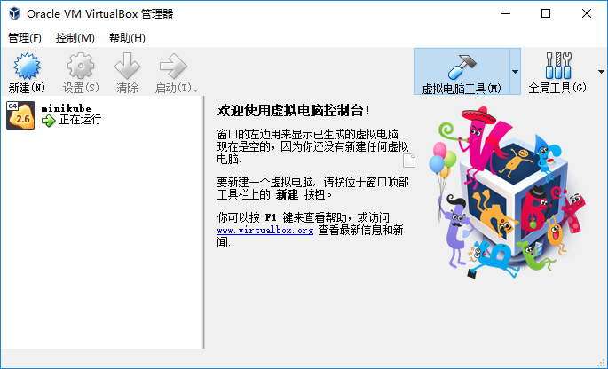

> minikube可以在本地（的虚拟机中）建立一个单节点的kubernete集群

# windows上安装minikube

1. 安装virtualbox
2. 将virtualbox安装目录中的VBoxManage.exe添加到path中
3. 下载minikube-installer.exe，下载网址为https://github.com/kubernetes/minikube/releases
4. 安装minikube
5. 将minikube添加到path中

# minikube的使用

```bash
# 查看状态
minikube status
# 启动
minikube start
# 删除
minikube delete
# 控制台
minikube dashboard
```

# 第一次minikube start

第一次运行时，将会

1. 下载Minikube ISO文件

2. 下载kubelet

3. 下载kubeadm

每一次启动时，都会在Virtual Box中 重新新建一个虚拟机，如下图所示



# 参考资料

https://kubernetes.io/docs/tasks/tools/install-minikube/#install-kubectl
